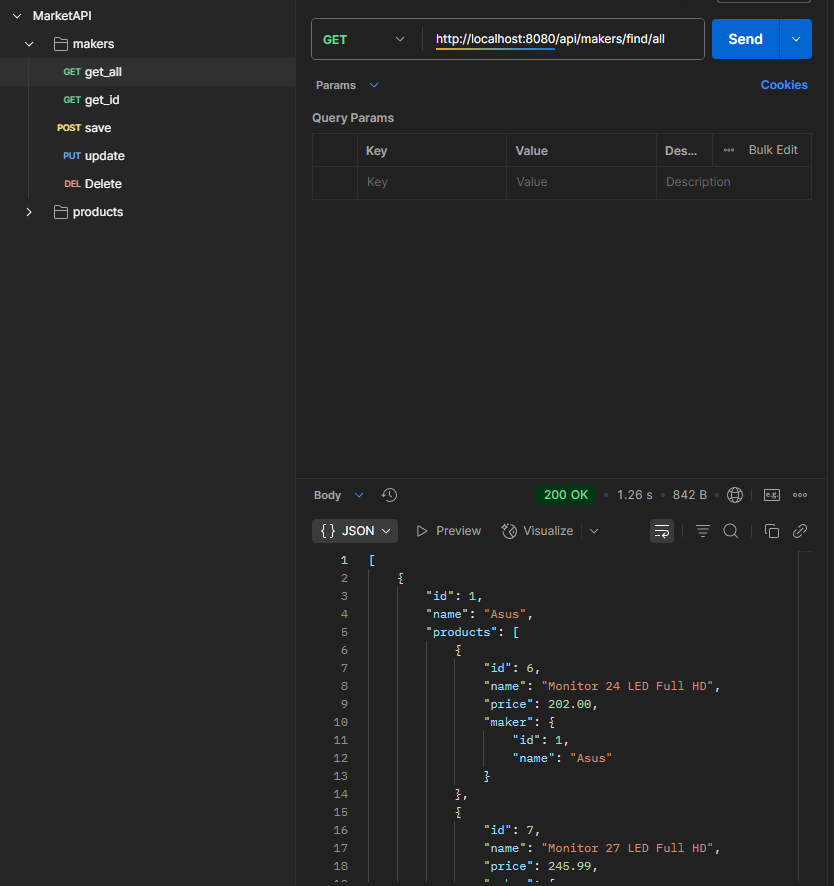
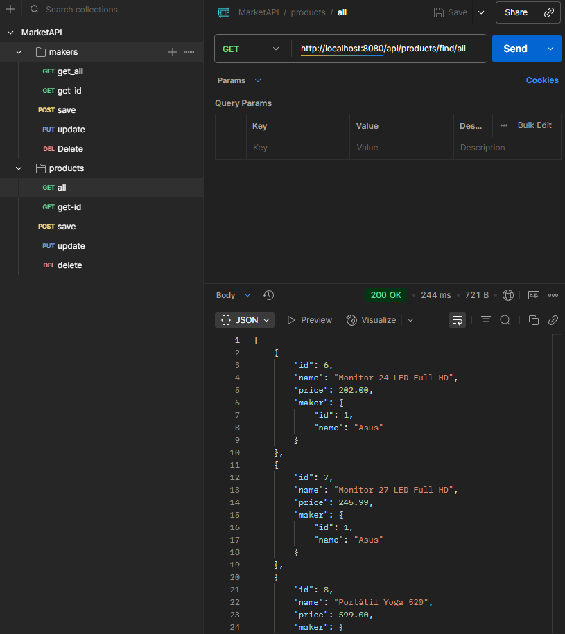
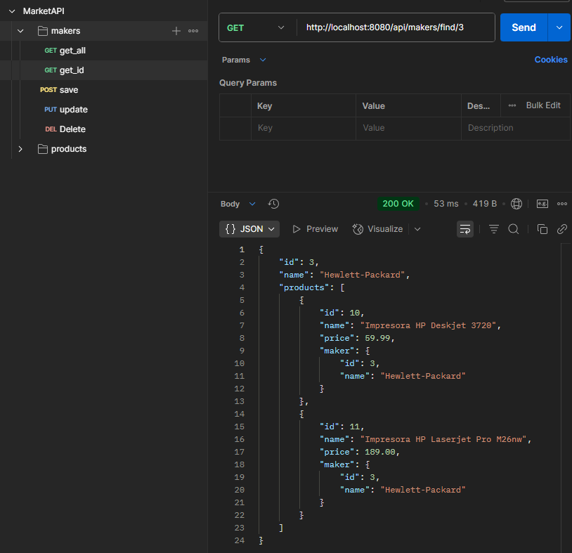
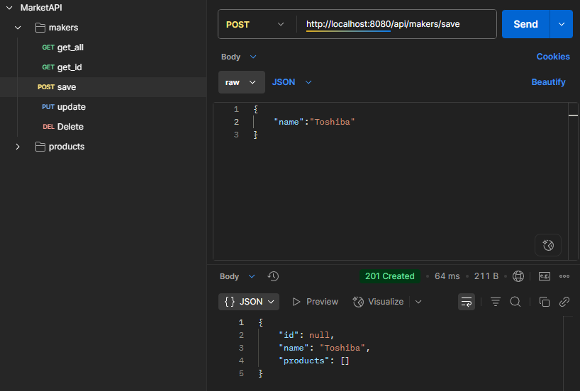

# MARKET API REST
---
Desarrollé una API REST utilizando el framework Spring Boot, enfocada en la gestión de fabricantes y sus productos. Esta aplicación permite registrar, actualizar, consultar y eliminar información tanto de fabricantes como de los productos asociados a cada uno de ellos. El proyecto está estructurado siguiendo buenas prácticas de desarrollo, con arquitectura desacoplada y manejo adecuado de relaciones entre entidades.

## 🛠Pruebas Postman
### GET ALL MAKERS

### GET ALL PRODUCTS

###GET BY ID

### POST and PUT

